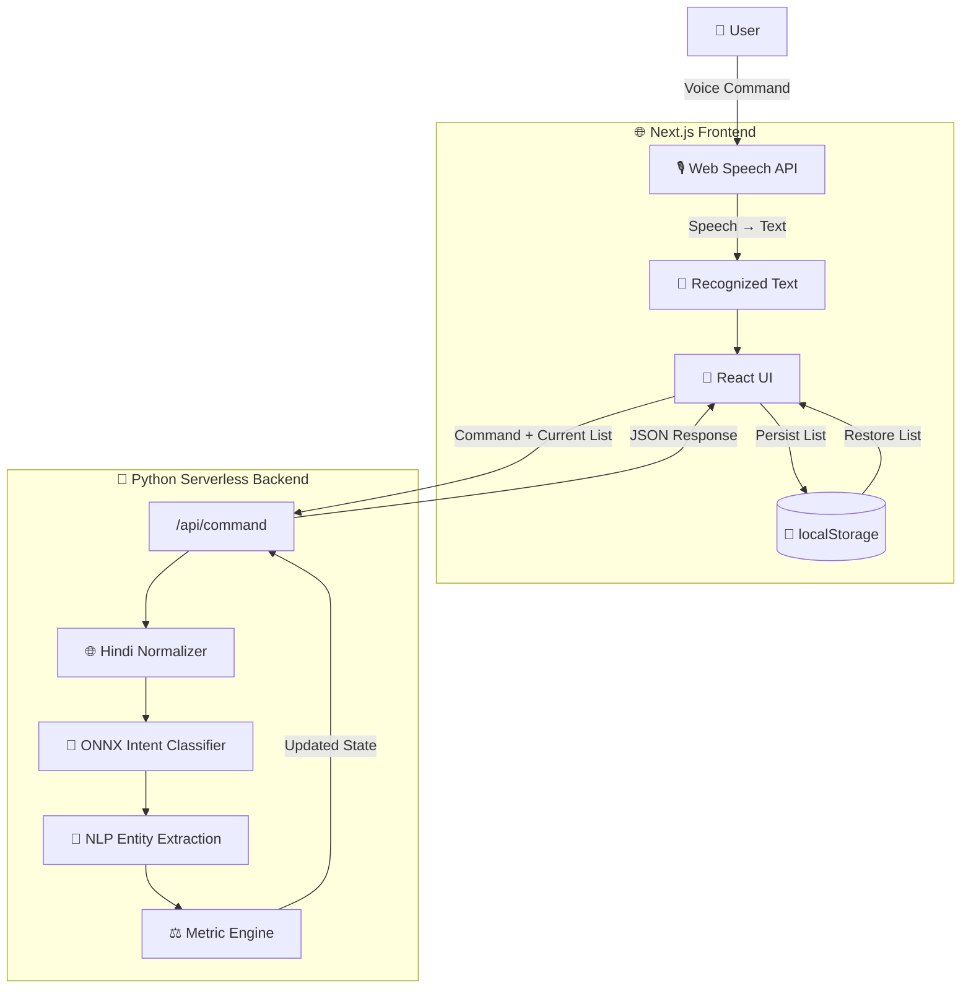
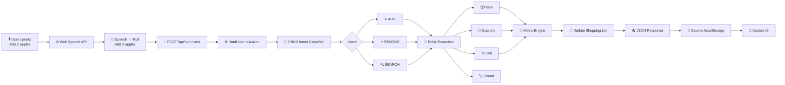
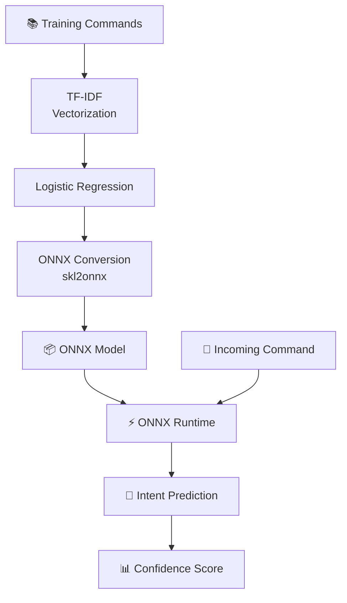
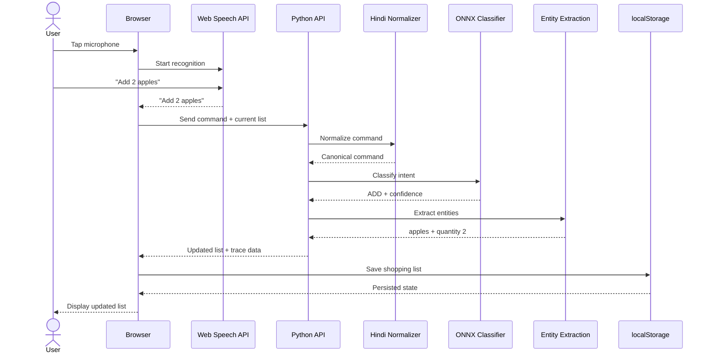
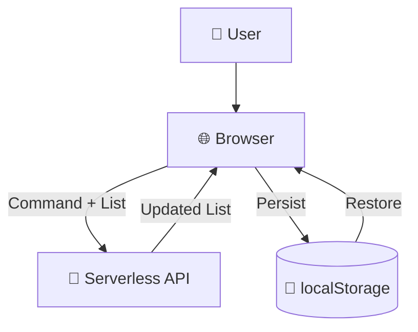
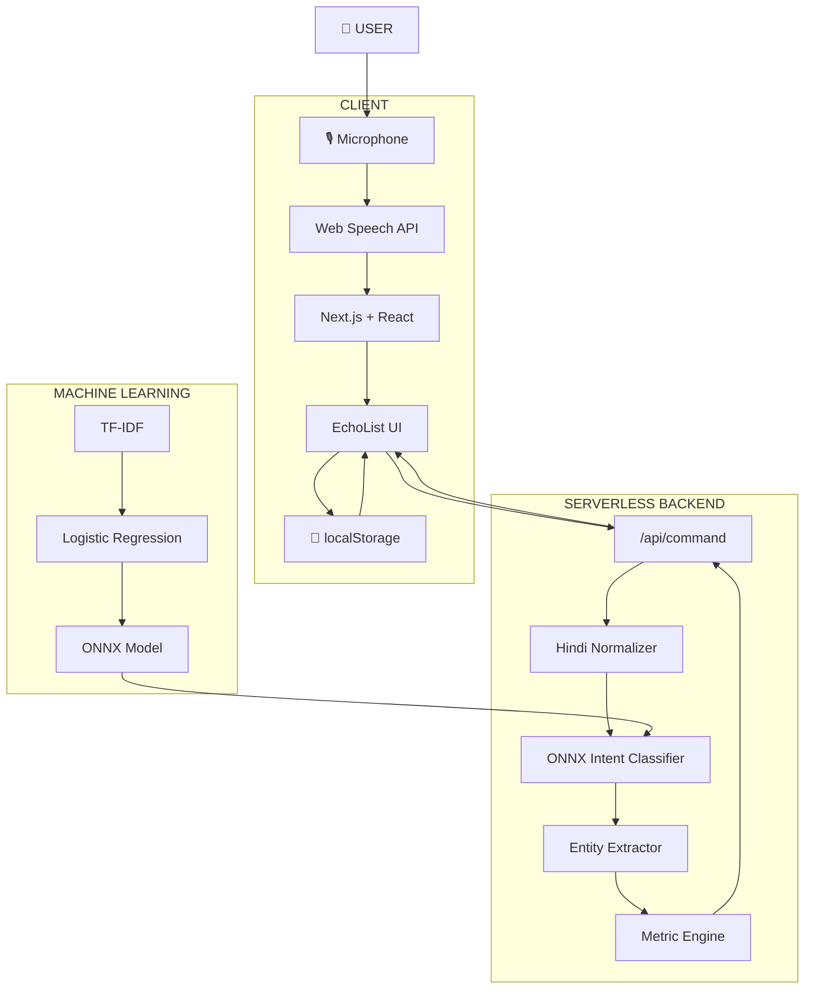
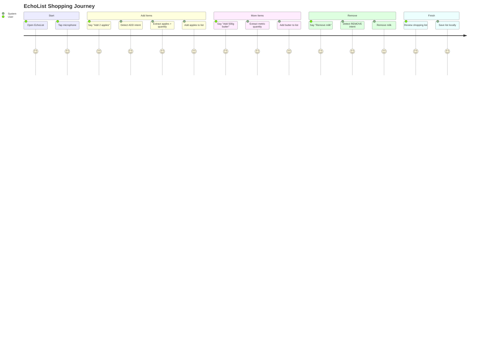

# 🛒 EchoList

### Voice-Activated Shopping Assistant

EchoList is a voice-activated shopping list manager that allows users to manage their shopping lists using natural voice commands.

Instead of manually typing items, users can simply speak commands such as:

> "Add 2 apples"

> "Remove milk"

> "Search for organic eggs"

EchoList processes these commands using browser-based speech recognition, a Python serverless backend, and a lightweight ONNX machine-learning model.

🌐 **Live Demo:** https://unthinkable-project-voice-commandin.vercel.app/

💻 **GitHub:** https://github.com/Harshit-Singh-Rao/unthinkable-project-voice-commanding

---

## ✨ Features

| Feature | Description |
|---|---|
| 🎙️ **Voice-First UI** | Manage your shopping list using voice commands |
| 🌐 **English + Hindi** | Supports English and Hindi commands |
| 🤖 **ONNX ML Inference** | Uses a lightweight intent-classification model |
| 🧠 **Intent Detection** | Detects `ADD`, `REMOVE`, and `SEARCH` commands |
| 🔎 **Entity Extraction** | Extracts items, quantities, brands, and units |
| ⚖️ **Metric Engine** | Supports metric quantity arithmetic |
| 🔒 **Stateless Backend** | No database is required |
| 💾 **Local Storage** | Shopping data is stored in browser `localStorage` |
| 🔍 **Trace Panel** | Displays intent, confidence, and extracted information |
| ☁️ **Serverless Deployment** | Designed to run on Vercel |

---

# 🏗️ Architecture



---

# 🔄 Command Processing Flow

The complete lifecycle of a voice command looks like this:



---

# 🧠 Machine Learning Architecture

EchoList uses a lightweight machine-learning approach instead of relying on an external LLM or cloud AI API.

The intent classifier is based on:

- TF-IDF vectorization
- Logistic Regression
- `skl2onnx`
- ONNX Runtime



---

# 🎯 Supported Intents

## ➕ ADD

Adds an item to the shopping list.

Example:

```text
Add 2 apples
```

Result:

```text
Item: apples
Quantity: 2
Intent: ADD
```

---

## ➖ REMOVE

Removes an item from the shopping list.

Example:

```text
Remove milk
```

Result:

```text
Item: milk
Intent: REMOVE
```

---

## 🔍 SEARCH

Searches for an item.

Example:

```text
Search for organic eggs
```

Result:

```text
Item: organic eggs
Intent: SEARCH
```

---

# 🌐 Multilingual Support

EchoList supports English and Hindi voice commands.

Hindi commands are normalized using an internal alias/normalization system.

Example:

```text
दूध जोड़ो
```

is interpreted as:

```text
Add milk
```

The normalization process does not require an external translation API.


---

# ⚖️ Metric Engine

EchoList supports metric quantities and unit arithmetic.

For example:

```text
Add 500g butter
```

can be interpreted as:

```text
Item: butter
Quantity: 500
Unit: g
```

The metric engine can also handle compatible units.

Example:

```text
200g + 1kg
```

becomes:

```text
1.2kg
```

---

# 🎙️ Example Voice Commands

## Add Items

```text
"Add 2 apples"
```

```text
"Add 500g butter"
```

```text
"Add 1kg rice"
```

## Remove Items

```text
"Remove milk"
```

```text
"Remove apples"
```

## Search

```text
"Search for organic eggs"
```

## Hindi

```text
"दूध जोड़ो"
```

---

# 🧩 System Sequence



---

# 💻 Tech Stack

| Layer | Technology |
|---|---|
| **Frontend** | Next.js 14, React |
| **Styling** | Tailwind CSS |
| **Animation** | Framer Motion |
| **Speech Recognition** | Web Speech API |
| **Backend** | Python 3.10+, Flask |
| **ML Runtime** | ONNX Runtime |
| **ML Model** | TF-IDF + Logistic Regression |
| **ML Conversion** | `skl2onnx` |
| **Hosting** | Vercel |
| **State Management** | Browser `localStorage` |

---

# ⚙️ Running Locally

## Prerequisites

Make sure the following are installed:

- Node.js 18+
- Python 3.10+
- npm
- pip
- Vercel CLI

---

## 1. Clone the Repository

```bash
git clone https://github.com/Harshit-Singh-Rao/unthinkable-project-voice-commanding.git

cd unthinkable-project-voice-commanding
```

---

## 2. Install Frontend Dependencies

```bash
npm install
```

---

## 3. Install Python Dependencies

```bash
pip install -r requirements.txt
```

---

## 4. Start the Development Server

The recommended development command is:

```bash
npx vercel dev
```

This runs the Next.js frontend and Python serverless API together using Vercel's local development environment.

---

# ☁️ Deployment

EchoList is configured for deployment on Vercel.

## Deploy Using Vercel

1. Push the repository to GitHub.
2. Open Vercel.
3. Import the GitHub repository.
4. Select **Next.js** as the framework.
5. Keep the root directory as:

```text
./
```

6. Click **Deploy**.

Vercel automatically detects the project's configuration and Python dependencies.

No database or environment variables are required by the current project.

---

# 🔒 Privacy & Data Architecture

EchoList is designed around a stateless backend.

The backend does not maintain a persistent shopping-list database.

Instead, shopping-list state is stored in the user's browser.



### Benefits

- No database required
- Simple deployment
- Minimal backend infrastructure
- User data remains in browser storage
- Stateless API architecture

---

# 🔍 Trace Panel

EchoList includes a trace/debug panel that helps visualize how a voice command was interpreted.

It can expose information such as:

```text
Intent: ADD

Confidence: 0.XX

Item: apples

Quantity: 2

Unit: none
```

This makes the ML pipeline easier to understand and debug.

---

# 🧪 Testing

The project contains a dedicated testing directory:

```text
tests/
```

It also includes:

```text
smoke_test.py
```

You can run the smoke test with:

```bash
python smoke_test.py
```

For full application testing:

```bash
npx vercel dev
```

Then open the local application and test voice commands through the browser.

---

# 📡 API

The primary backend endpoint is:

```text
POST /api/command
```

The frontend sends the recognized command and current shopping-list state to the backend.

A conceptual request looks like:

```json
{
  "command": "Add 2 apples",
  "list": []
}
```

The backend processes the command and returns the updated state.

A conceptual response may look like:

```json
{
  "intent": "ADD",
  "confidence": 0.95,
  "item": "apples",
  "quantity": 2,
  "unit": null,
  "list": [
    {
      "item": "apples",
      "quantity": 2
    }
  ]
}
```

> Note: The exact request and response schema should be treated according to the current implementation in `/api/command`.

---

# 🎨 User Experience

The application uses a voice-first interface.

The primary interaction is a glowing microphone/orb interface that indicates when the application is listening.

The user flow is intentionally simple:

```text
Open EchoList
      ↓
Tap to Speak
      ↓
Say a Command
      ↓
Command Recognized
      ↓
Intent Detected
      ↓
Entity Extracted
      ↓
Shopping List Updated
```

---

# 🧠 Design Philosophy

## Voice First

The application is designed around natural voice interaction rather than traditional text input.

## Lightweight Machine Learning

EchoList uses a compact ML classifier instead of depending on an external LLM.

This helps reduce:

- Infrastructure complexity
- External API dependencies
- AI inference costs
- Network dependency
- Data sent to third-party AI services

## Stateless Backend

The backend processes commands without maintaining a user database.

## Local Persistence

The shopping list is persisted through browser `localStorage`.

## Transparent AI

The trace panel provides insight into the model's interpretation instead of hiding the entire processing pipeline.

---

# 🚧 Current Limitations

### Browser Speech Recognition

Voice recognition depends on browser support for the Web Speech API.

### Limited Intent Set

The current classifier primarily handles:

```text
ADD
REMOVE
SEARCH
```

More complex conversational commands would require additional intent classes and training data.

### Browser-Based Storage

Because the shopping list is stored in `localStorage`:

- Data is tied to the browser/device
- Clearing browser storage can remove the list
- Lists are not automatically synchronized between devices

### Stateless Backend

There is currently no persistent user account or cloud database.

---


# 📊 Complete Application Overview



---

# 🎯 Example User Journey



---

# 📌 Project Highlights

EchoList demonstrates the integration of several technologies and concepts:

- 🎙️ Speech Recognition
- 🧠 Natural Language Processing
- 🤖 Machine Learning
- 📦 ONNX Model Deployment
- 🌐 Multilingual Command Processing
- ⚖️ Metric Arithmetic
- ⚛️ React / Next.js
- 🐍 Python
- ☁️ Serverless Architecture
- 💾 Browser Storage
- 🐳 Docker
- 🚀 Vercel Deployment

---

# 👨‍💻 Author

## Harshit Singh Rao

GitHub:

https://github.com/Harshit-Singh-Rao

Project Repository:

https://github.com/Harshit-Singh-Rao/unthinkable-project-voice-commanding

---


# 🛒 EchoList in One Sentence

> **EchoList transforms natural voice commands into actionable shopping-list operations using browser speech recognition, lightweight ONNX machine learning, multilingual normalization, metric processing, and a serverless architecture.**
