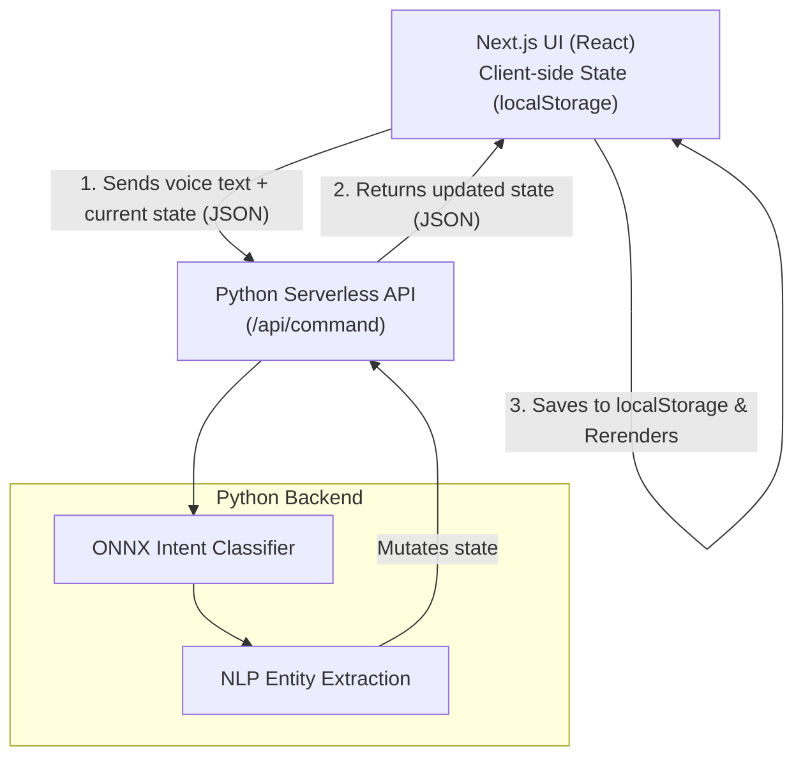

<div align="center">
  <h1>F.A.B.U.L.I.N.U.S.</h1>
  <h3>Fast Assistant, Built Using Logistic Inference — Native Understanding & Speech</h3>
</div>

---

## Overview

**F.A.B.U.L.I.N.U.S.** is a voice-activated shopping list manager, now modernized for a serverless environment (Vercel). The frontend is built with **Next.js (React) and Tailwind CSS**, providing a sleek "Jarvis HUD" UI. The backend runs as **Python Serverless Functions**, handling local ONNX intent classification, entity extraction, and metric arithmetic.

The application is completely **stateless**. User data (shopping lists and purchase histories) is stored entirely client-side using `localStorage`, ensuring privacy and avoiding any database provisioning, making it perfectly suited for free-tier serverless deployments.

---

## Features

- **Voice-first "Jarvis HUD" UI**: A dark Next.js interface with a glowing amber orb that reacts to your voice.
- **English + Hindi**: Hindi commands are normalised to canonical English.
- **Local ONNX inference**: Intent classification runs inside the Python backend using a compiled ONNX model.
- **Metric engine & quantity caps**: Understands unit arithmetic ("add 200g then 1kg = 1.2kg").
- **Stateless Architecture**: No databases required. The React frontend maintains the state and passes it to the Python API on each request.
- **Trace panel**: A collapsible panel shows how each command was understood.

---

## Architecture



---

## Running Locally

Requirements: Node.js, Python 3.10+

1. Install backend dependencies:
```bash
pip install -r requirements.txt
```

2. Install frontend dependencies:
```bash
npm install
```

3. Run the Next.js development server (which automatically proxies `/api` calls to the local Python backend via `vercel.json` or Next.js rewrites, but for pure local dev you can use Vercel CLI):
```bash
npx vercel dev
# OR simply run npm run dev if you set up next.config.mjs rewrites
```

---

## Vercel Deployment

This repository is ready for a 1-click Vercel deployment:
1. Connect your GitHub repository to Vercel.
2. The framework preset should be **Next.js**.
3. Vercel will automatically detect `vercel.json` and install Python dependencies from `requirements.txt` to run the `/api` folder as serverless functions.
4. **No database setup needed.**

