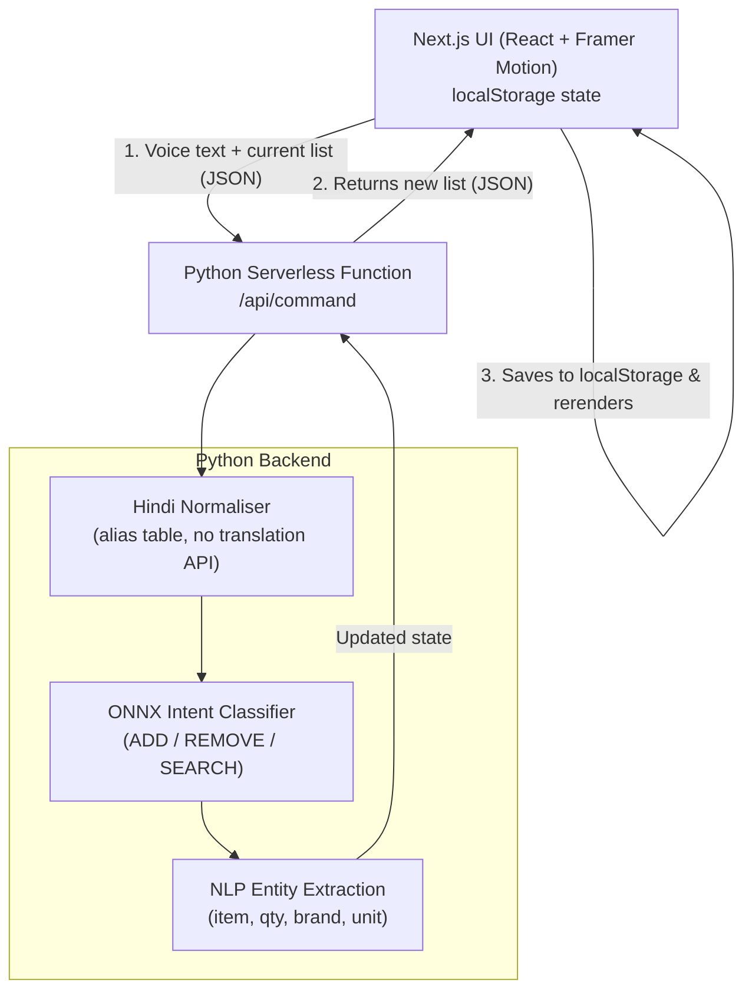

<div align="center">
  <h1>🛒 EchoList</h1>
  <h3>Voice-Activated Shopping Assistant</h3>
  <p>
    <a href="https://unthinkable-project-voice-commandin.vercel.app/">🔴 Live Demo</a> &nbsp;|&nbsp;
    <a href="#running-locally">⚙️ Run Locally</a> &nbsp;|&nbsp;
    <a href="#architecture">🏗 Architecture</a>
  </p>
</div>

---

## Overview

**EchoList** is a voice-activated shopping list manager built for a modern serverless environment. Speak naturally to add, remove, or search for items — in **English or Hindi**.

The frontend is built with **Next.js 14 (React) + Tailwind CSS + Framer Motion**, providing a sleek dark UI with a glowing amber orb that pulses when listening. The backend runs as **Python Serverless Functions** on Vercel, using a compiled **ONNX intent classifier** for on-device ML inference — no LLM, no cloud AI calls.

The app is completely **stateless on the server**. Shopping lists and purchase histories are stored in the browser's `localStorage`, so no database is needed.

---

## Features

| Feature | Details |
|---|---|
| 🎙️ Voice-first UI | Glowing amber orb with pulse animation while listening |
| 🌐 English + Hindi | Hindi commands are normalised to canonical English offline |
| 🤖 Local ONNX Inference | TF-IDF + logistic regression compiled into ONNX, runs in Python |
| ⚖️ Metric Engine | Understands unit arithmetic: `200g + 1kg = 1.2kg` |
| 🔒 Stateless & Private | All user data lives in `localStorage` — no server, no DB |
| 🔍 Trace Panel | Collapsible debug panel shows intent, confidence, and extracted slots |

---

## Architecture



---

## Running Locally

**Requirements:** Node.js 18+, Python 3.10+

```bash
# 1. Install frontend dependencies
npm install

# 2. Install backend dependencies
pip install -r requirements.txt

# 3. Run with Vercel CLI (handles both Next.js + Python API together)
npx vercel dev
```

> 💡 `npx vercel dev` is the recommended way to run locally as it replicates the Vercel routing (Next.js on port 3000, Python API proxied automatically).

---

## Vercel Deployment

This repo is ready for **1-click Vercel deployment**:

1. Connect your GitHub repo to [Vercel](https://vercel.com/new).
2. Set **Framework Preset** → **Next.js**.
3. Leave **Root Directory** as `./`.
4. Click **Deploy**.

Vercel auto-detects `vercel.json` and installs `requirements.txt` for the Python serverless functions. **No database or environment variables needed.**

---

## Voice Commands

Try saying:
- `"Add 2 apples"` → adds 2 apples
- `"Add 500g butter"` → adds with metric unit
- `"Remove milk"` → removes milk from the list
- `"Search for organic eggs"` → searches the catalog
- Hindi: `"दूध जोड़ो"` → adds milk

---

## Tech Stack

| Layer | Technology |
|---|---|
| Frontend | Next.js 14, React, Tailwind CSS, Framer Motion |
| Speech | Web Speech API (browser-native) |
| Backend | Python 3.10+, Flask, ONNX Runtime |
| ML Model | TF-IDF + Logistic Regression → skl2onnx |
| Hosting | Vercel (Next.js + Python Serverless) |
| State | Browser `localStorage` (no database) |
